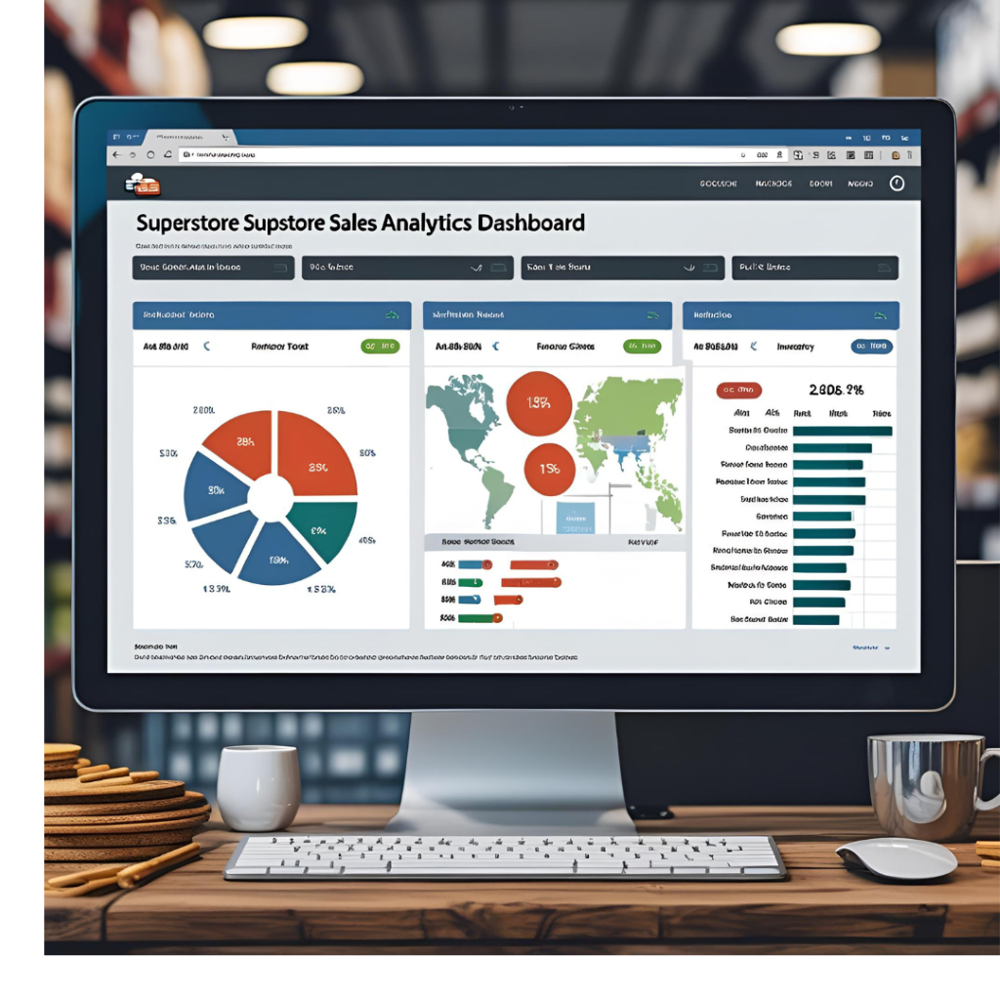

  
  <h1>Hello, I'm Noureen Hussien! 👋</h1>
  
  
<strong>💡 Data Scientist | AI & ML Specialist | MLOps Enthusiast</strong>

  
Transforming complex datasets into predictive, high-impact business solutions.📍 Alexandria, Egypt

---

## 🚀 Core Focus & Technical Stack

I specialize in **end-to-end Machine Learning pipelines**, focusing on **Deep Learning, NLP**, and **Cloud Infrastructure**. My goal is to architect intelligent, scalable systems.

<strong><h3 style="display:inline-block;">Expand Technical Stack Details 🛠️</h3></strong>

 

| Category | Skills & Technologies |
| :--- | :--- |
| **Programming** | 
  
  
  
| **ML/DL Frameworks** | 
  
  
  
| **Specialization** |
  
  
| **Analysis & Viz** | 
  
  
  
  
| **Tools & Cloud** |
  
  
  

---

## 💡 Featured Projects (High-Impact Modules)

I follow an **MLOps approach** for building robust, deployable models.

<strong><h3 style="display:inline-block;">Expand Project Portfolio 📂</h3></strong>

 

<table width="100%">
  <tr>
    <td width="33%">
      

        <h4>1. Starbucks Sentiment Analysis</h4>
        
        
<strong><small>Key Skill: NLP, Text Classification, TextBlob</small></strong>

        
<small>Classifying public reviews to extract granular market feedback.</small>

        
      

    </td>
    <td width="33%">
      

        <h4>2. Superstore Sales Dashboard</h4>
        
        
<strong><small>Key Skill: Streamlit, Plotly, Real-time Viz</small></strong>

        
<small>Interactive dashboard for sales trend analysis and data exploration.</small>

        
      

    </td>
    <td width="33%">
      

        <h4>3. Boston Housing Prediction</h4>
        
        
<strong><small>Key Skill: Regression, Model Validation, Scikit-learn</small></strong>

        
<small>Predictive model achieving high $R^2$ score on complex spatial data.</small>

        
      

    </td>
  </tr>
</table>

---

## 📊 Performance Metrics

  
  

 

  
  
  

---

## 🤝 Initiate Connection

  
  
  

 

***&gt; EXECUTION_STATUS: COMPLETE. Thank you for visiting.***
